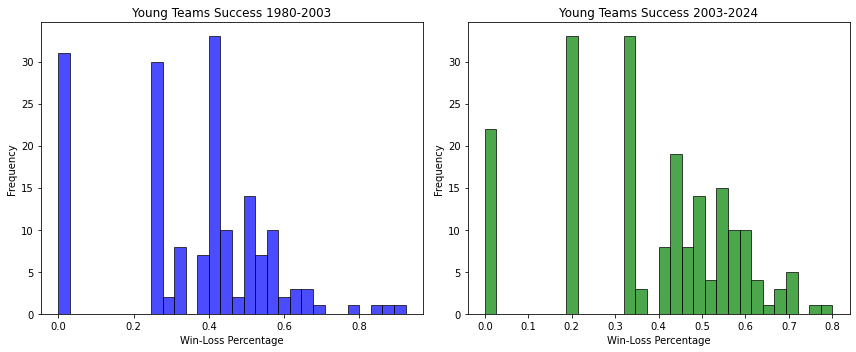
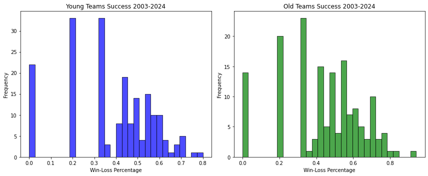
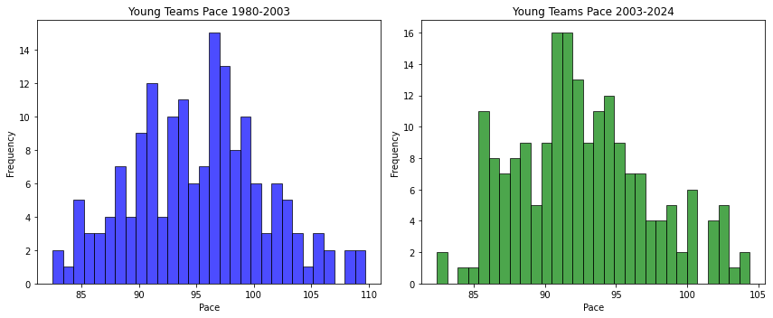
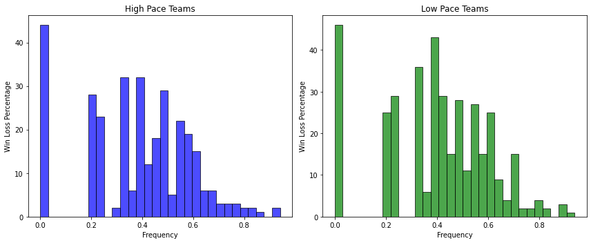

# Significance Tests Using NBA Data

This is a data analysis project using NBA Data to test some hypotheses about the influence of veterans and team pace on playoff success.
It works mostly as a showcase of web scaping nba data which can then be used to do data analysis tasks, such as significance testing.


## Table of Contents

- [Requirements](#requirements)
- [Installation](#installation)
- [Web Scraping](#web-scraping)
- [NBA Data](#nba-data)
- [Hypothesis testing](#hypothesis-testing)


## Requirements

To run this project, you need to have the following installed:

- Python 3.x
- pip (Python package manager)


## Installation

1. Clone the repository:
   ```bash
   git clone https://github.com/NickGreen99/NBA-Data-Significance-Tests.git

2. Install required dependencies:
   ```bash
   pip install -r requirements.txt
   
## Web Scraping

Using the Beautiful Soup library we can scrape the web for NBA data. 

For the purposes of this project, data were scraped from Basketball Reference (https://www.basketball-reference.com/),
which provides an incredibly extensive and comprehensive collection of stats throughout the years.

It's important to note that the webpage implements a rate limiting policy of up to 20 requests per minute, as to not overload their servers.

## NBA Data

The data that we were interested in for this project were from all the NBA playoff teams from the 1980-1981 season until the 2023-2024 season. More specifically we collected and looked at:  the average age of NBA playoff teams from the , as well as their win-loss percentage and pace. 

* Average age of each team weighted my the minutes played by each player

It's important to note that the average age of NBA playoff teams from Basketball Reference (while not explicitly stated on their webpage), is weighted by the minutes played by each player. This provides a more accurate representation of a team's age and it certainly comes in handy for our project, because one playoff team may have a lot of young players on their bench who play during garbage time and we don't want them to weigh heavily on the team's age. The formula for weighing the age of a team based on the minutes played is:
```math
\text{Average age weighed by  minutes} = \frac{\sum^{roster}_{i=1}{\text{Player age} * \text{Player minutes played}}}{\sum^{roster}_{i=1}{\text{Player minutes played}}}
```

* Pace

Pace (or Pace Factor) is an advanced stat that represents an estimate of possessions per 48 minutes. This advanced metric tells us how many combined possessions a team averages per 48 minutes (per game). In other words, if a team has a Pace Factor of 100, that means their games typically see 100 possessions in total (both sides). In our project it is used as an estimate of a team's quickness. The formula to calculate a team's Pace factor is:
```math
\text{Pace} = \frac{\text{Team Possessions} + \text{Opponent Possessions}}{2 * \frac{\text{Team Minutes Played}}{5}}
```

* Win-Loss Perentage

The stat we chose to measure team success in the playoffs. It's a better metric than counting playoff wins, since throughout the years the playoff format is not the same. The formula is:
```math
\text{Win-Loss Percentage} = \frac{\text{Playoff Wins}}{\text{Playoff Wins + Playoff Losses}}
```

## Hypothesis Testing
In order to do the hypothesis tests we use the independent t-test (either one-tailed or two-tailed depending on the hypothesis). This is a valid test to do because our data are in accordance with the assumptions needed to take to perform a t-test:
* It is reasonable to reduce the data to sample means (no outliers to influence the mean)
* 2 groups
* Small inter individual variability (10^-2 order of magnitude)
* Homogeneity of variance 

### Test 1: Playoff success of young teams before the best-of-seven playoff format (1980-2003) compared to after it (2003-2024)

- 

Ho (Null Hypothesis): The playoff success of young teams now is less than or equal to the playoff success of young teams in the past.

Test: One tailed independent t-test
* p-value: 0.075 > 0.05
* There is not enough evidence to reject the null hypothesis.

### Test 2: Playoff success of young teams compared to old teams from 2003-204

- 

Ho (Null Hypothesis): The playoff success of young teams now is greater than or equal to the playoff success of old teams now.

Test: One tailed independent t-test
* p-value: 0.003 < 0.05
* We reject the null hypothesis.
* Which means: The playoff success of young teams now is significantly less than the playoff success of old teams.
  
### Test 3: Playoff pace of young teams before the best-of-seven playoff format (1980-2003) compared to after it (2003-2024)

- 

Ho (Null Hypothesis): The playoff pace of young teams now is greater than or equal to the playoff pace of young teams in the past.

Test: One tailed independent t-test
* p-value: 3.11e-06 < 0.05
* We reject the null hypothesis.
* Which means: The playoff pace  of young teams now is significantly less than the playoff pace of young teams in the past.
  
### Test 4: Playoff success of high pace teams compared to low pace teams 

- 

Ho (Null Hypothesis): The playoff success of high pace teams compared to the playoff success of low pace teams is statistically different.

Test: Two tailed independent t-test
* p-value: 0.232
* There is not enough evidence to reject the null hypothesis. (In accordance to this: https://www.samford.edu/sports-analytics/fans/2023/Does-Controlling-the-Pace-Win-NBA-Games)
